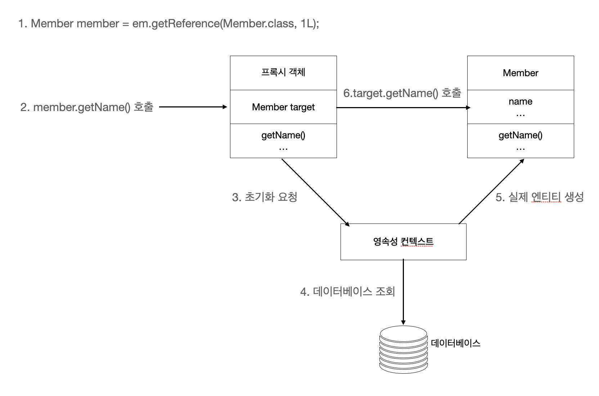

# 프록시와 연관관계 관리
## 프록시
### em.getReference()
`em.getReference()`를 사용하여 엔티티를 조회하면 데이터베이스 조회를 미룰 수 있도록하는 가짜 프록시 객체를 반환하고, 실제 값을 사용하는 시점에  데이터베이스에 쿼리를 날린다.

참고 : `em.find()`는 실제 엔티티 객체 반환

### 프록시 특징
- 프록시 객체는 실제 클래스를 상속 받아서 만들어짐(타입 체크시 주의! `==` 비교 대신 `instanceof` 연산자 사용)
- 프록시 객체는 최초 사용시 한번만 초기화 
- 프록기 객체가 실제 엔티티로 바뀌는건 아니고 프록시 객체를 통해서 실제 엔티티에 접근
- 프록시 객체는 내부에 실제 엔티티 객체의 참조 target을 가지고있어 프록시 객체의 메서드 호출시 실제 객체의 메서드를 호출해준다.
- 영속성 컨텍스트에 엔티티가 이미 있으면 `em.getReference()`를 호출해도 실제 엔티티가 반환된다. -> JPA에선 한 트랜잭션 안에서 같은 PK 값을 가진 엔티티에 대해 `==` 비교시 항상 `true`임을 보장하기 때문
    - 반대의 경우도 마찬가지. `em.getReference()`로 프록시 객체로 불러왔다면 후에 `em.find()`로 조회를 해도 프록시 객체가 반환된다.
- 영속성 컨텍스트의 도움을 받을 수 없는 준영속 상태일 떄, 프록시를 초기화하면 `org.hibernate.LazyInitializationException`예외 발생(하이버네이트 기준)

### 프록시 초기화 과정

### 프록시 관련 메서드
- 프록시 인스턴스 초기화 여부 확인(emf : EntityManagerFactory) : `emf.getPersistenceUnitUtil().isLoaded()`
- 프록시 강제 초기화(하이버네이트) : `org.hibernate.Hibernate.initialize(entity)`
    - JPA 표준에는 강제 초기화 방법 없다.

## 즉시 로딩과 지연 로딩
https://developer-hm.tistory.com/37?category=928692

## 영속성 전이(cascade), 고아 객체(orphanRemoval)
https://developer-hm.tistory.com/47?category=928692
